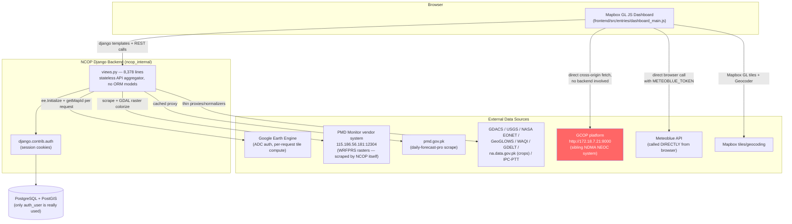
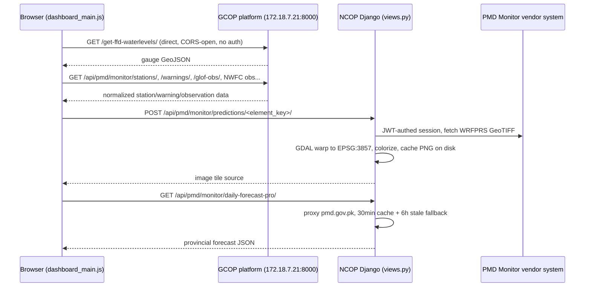
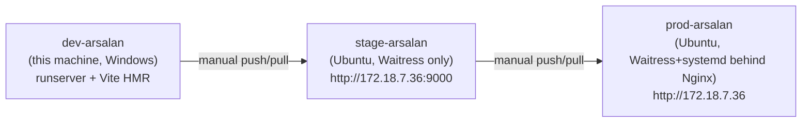
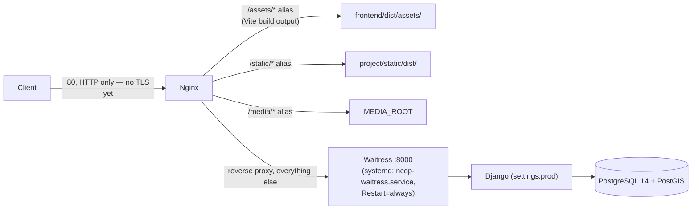

# NCOP — Project Context (A to Z)

> **Purpose of this file**: a single, dense, framework-aware map of the whole NCOP codebase so that any AI assistant (or human) can get oriented in one read instead of re-deriving architecture from scratch across many tool calls. Written 2026-08-05 against branch `dev-arsalan` @ commit `d79fe05`. Regenerate the companion code graph (see [§10](#10-code-graph-graphifyy)) after significant refactors — this document itself should be refreshed manually when architecture changes, not on every commit.

---

## 1. What NCOP Is

**NCOP** (the exact expansion wasn't found verbatim in-repo, but functionally: a **N**ational **C**ontingency/**C**ommon **O**perating **P**icture for **P**akistan) is a Django + Mapbox GL dashboard for disaster/hazard monitoring: floods, fires, landslides, cyclones, seismic risk, drought, heatwaves, air quality, crop conditions, and weather forecasting — built for Pakistan's disaster-management context (NDMA-affiliated). It aggregates a large number of live third-party geospatial/weather data sources onto one interactive map, adds Google Earth Engine-computed hazard-susceptibility layers, and includes a "story mode" for narrated, chapter-based hazard briefings.

It is a **sibling application to a larger platform called GCOP** (Global Common Operating Picture) — this is the single most important architectural fact to internalize (see [§6](#6-external-integrations)).

---

## 2. Tech Stack At a Glance

| Layer | Technology |
|---|---|
| Backend framework | Django 5.1 + Django REST Framework 3.15.2 |
| Backend app | **One** Django app: `ncop_internal` — no ORM models, no migrations of substance, effectively a stateless API-aggregation layer |
| Database | PostgreSQL 14 + PostGIS (used almost entirely for `django.contrib.auth`'s `auth_user` table only — see [§5.2](#52-no-real-orm-layer)) |
| Frontend build | Vite 7 (via `rolldown-vite`) — **vanilla JS, not React/Vue**, multi-entry build |
| Map engine | Mapbox GL JS v3 |
| Geospatial compute | Google Earth Engine (`earthengine-api`), GDAL, GeoPandas, Shapely, PyProj |
| Styling | Tailwind CSS v4 + hand-written CSS partials + Bootstrap 5 (legacy/auth pages) |
| Static/asset serving | `django-vite` (dev proxy → Vite dev server; prod → built manifest) + WhiteNoise + Nginx (prod) |
| App servers | Django `runserver` (dev), Waitress (staging + prod, behind Nginx in prod) |
| AI/vector deps present but **unused** | `chromadb`, `langchain`, `langchain-groq` — imported, never instantiated (dead code from an abandoned chatbot/RAG plan) |
| Code-graph tooling | `graphifyy` (tree-sitter based, no LLM required for extraction) — see [§10](#10-code-graph-graphifyy) |

---

## 3. Repository Layout

```
ncop_local/
├── .env / .env.staging / .env.example      # environment config (per-env secrets/hosts)
├── requirements.txt                         # UTF-16LE encoded(!) — see note below
├── CONTEXT.md                                # this file
├── graphify-out/                             # generated code graph (graph.json/html, GRAPH_REPORT.md)
├── frontend/                                 # Vite frontend (vanilla JS, no framework)
│   ├── vite.config.js
│   ├── package.json
│   ├── index.html                            # scaffold smoke-test page, not linked from Django urls
│   ├── templates/auth/                       # auth page templates (login/signup/reset) — OUTSIDE project/templates
│   └── src/
│       ├── entries/                          # 5 Vite build entries (1:1 with Django templates)
│       ├── modules/                          # ~31 feature modules, imported by entries
│       ├── styles/                           # dashboard.css aggregator + partials, auth CSS
│       └── assets/                           # images (legends, thumbnails, icons) + story_jasons/ (story configs)
├── project/                                  # Django project root
│   ├── manage.py                             # hardcodes DJANGO_SETTINGS_MODULE=ncop_project.settings.dev
│   ├── ncop_project/
│   │   ├── settings/{base,dev,staging,prod}.py
│   │   ├── urls.py                           # root: admin/ + include(ncop_internal.urls) + /media/ passthrough
│   │   ├── wsgi.py                           # defaults to settings.prod if unset
│   │   ├── wsgi_staging.py                   # hardcodes settings.staging
│   │   └── asgi.py
│   ├── ncop_internal/                        # THE app — everything lives here
│   │   ├── views.py                          # 8,378 lines, ~179 functions/classes — see §5.3
│   │   ├── urls.py                           # 120 lines, ~45 routes — see §5.4
│   │   ├── models.py                         # 3 lines — empty stub, no models
│   │   ├── admin.py                          # 3 lines — empty stub
│   │   └── migrations/                       # only __init__.py, no real migrations
│   ├── templates/                            # dashboard.html, documentation.html, index.html
│   ├── static/{src,dist}/                    # collectstatic output + docs images
│   └── cache/heatwave/                       # ad-hoc disk cache (not Django's CACHES framework)
├── misc/                                     # deployment handbooks, thesis, reports, GDAL wheel, etc.
├── GCOP_PMD_API_Integration.md               # root-level integration notes (see §6)
├── GCOP_PMD_Weather_Report_Feature.md
├── PMD Monitor_scrapping_methodology.txt
├── PMD_Forecast_Layers.txt
├── nwfc_weather_types.txt
└── ncopenv311/                                # committed venv (gitignored) — Python 3.11
```

**Encoding gotcha**: `requirements.txt` is **UTF-16LE with BOM**, not UTF-8. Any tool that opens/writes it as UTF-8 will corrupt it. Use `encoding='utf-16-le'` in Python or a BOM-aware editor.

---

## 4. System Architecture (High Level)



**Key insight**: NCOP's Django backend is **not** the single source of truth for map data. A large share of live layers (PMD Monitor stations/warnings/monsoon/GLOF/lightning, FFD flood gauges, NWFC weather observations) are fetched **directly by the browser from the GCOP platform** at `http://172.18.7.21:8000`, completely bypassing `ncop_internal/views.py`. NCOP's own backend only independently implements a *subset*: GEE hazard layers, WRFPRS precipitation raster tiles, a cached daily-forecast-pro proxy, GDACS/USGS/EONET/GeoGLOWS/WAQI/GDELT/crops/IPC proxies, and story-mode JSON. See [§6](#6-external-integrations) for the full breakdown.

---

## 5. Backend (Django) Deep Dive

### 5.1 Settings package (`project/ncop_project/settings/`)

Package-style settings: `base.py` (shared) + `dev.py` / `staging.py` / `prod.py` (each does `from .base import *` and overrides). `manage.py` hardcodes `dev`; `wsgi.py` defaults to `prod` if `DJANGO_SETTINGS_MODULE` isn't set; `wsgi_staging.py` hardcodes `staging`.

Notable base.py behavior:
- Custom GDAL/PROJ/GEOS DLL-path bootstrap (lines ~37–122) to make GeoDjango work cross-platform (Windows dev vs Linux prod) without silent empty-raster bugs.
- Reads `.env` from the **repo root** (one level above `project/`), shared with Vite's own env loading (`frontend/vite.config.js` also reads repo-root `.env` via `loadEnv`) — this is why editing root `.env` affects both Django and Vite dev server behavior (as seen when fixing the `VITE_DEV_SERVER_HOST`/GEE project issues earlier).

| | dev | staging | prod |
|---|---|---|---|
| `DEBUG` | True | False | False |
| Vite | `dev_mode=True`, base `"/"` | `dev_mode=False`, base `"/"` (WhiteNoise serves) | `dev_mode=False`, `/static/` prefix (**Nginx** serves `/assets/*` directly) |
| Security | none extra | HSTS/SSL/cookie-secure **disabled**, `OAUTHLIB_INSECURE_TRANSPORT=1` | HSTS 1yr+subdomains+preload, secure cookies, `SECURE_SSL_REDIRECT` — but see [§8 gotchas](#8-known-gotchas--inconsistencies): **prod is not actually on HTTPS yet** |
| Cache | Django default locmem | named `LocMemCache` "ncop-staging-cache", 300s | **no `CACHES` wired to Redis despite `django-redis`/`redis` in requirements** — falls back to implicit locmem |
| Static storage | Manifest | `CompressedStaticFilesStorage` (no manifest — avoids 500s on missing files) | Manifest |

`INSTALLED_APPS`: django admin/auth/contenttypes/sessions/messages/staticfiles/**gis**, `rest_framework`, `corsheaders`, `django_vite`, `ncop_internal`, `django_extensions`. That's it — no other custom apps.

`MIDDLEWARE` (identical across envs): Security → WhiteNoise → CORS → Session → Common → CSRF → Auth → Messages → XFrameOptions.

### 5.2 No real ORM layer

`ncop_internal/models.py` and `admin.py` are 3-line stubs; `migrations/` has only `__init__.py`. **No domain data is stored in Postgres.** A commented-out import block (`views.py:54-59`) references a richer legacy model set (`DistrictBoundary`, `MajorDamsLevel`, `Incident`, `NcopHazardAlert`, etc.) — evidence of a prior, more DB-centric design that was stripped out in favor of the current live-proxy/aggregator architecture. Persistence that does exist:
- `django.contrib.auth`'s built-in `auth_user` table (session-based login, no custom `User` model).
- Flat JSON files for "stories" (`STORY_JSON_DIR`, `_load_json`/`_save_json` in views.py).
- Ad-hoc filesystem caches: `project/cache/heatwave/` (disk TTL cache with a 1024-file janitor cap) and a PMD-prediction PNG cache under `MEDIA_ROOT/pmd_predictions/`.
- In-process `threading.Lock`/`Semaphore` singletons scattered per feature (heatwave, GDELT, wind/ocean particles, PMD Monitor session, GDAL raster conversion) used as ad-hoc concurrency guards instead of Django's cache framework.

### 5.3 `views.py` map (8,378 lines — read by line range, never in full)

| Lines | Area | Key symbols |
|---|---|---|
| 116–276 | Auth | `dashboard_view`, `documentation_view`, `login_view`, `signup_view`, `logout_view`, `password_reset_view`, `password_reset_confirm_view` |
| 279–398 | Story content (flat-file JSON CRUD) | `StoriesView`, `StoryDetailView`, `_load_json`/`_save_json` |
| 399–2434 | Weather/hazard feed proxies | `WeatherDataPMDFFDView`, `HeatwaveMonitoringView`/`HeatwaveDetailView`, `WAQIgeojson`, `SlickPlusGeojsonApi`, GDACS/EONET/USGS/GeoGLOWS view classes |
| 2508–4820 | **GEE hazard-layer engine** | `initialize_earth_engine()` (module-level, runs at import time), `SemanticSearchHelper`, `GEEDataCatalog` (37 datasets), `EnhancedCompute`, `AHPModels`, `DynamicGEELayerView`, `TemporalGEELayerView`, `GEECatalogView`, `GenerateLegendView` — full detail in [§7](#7-google-earth-engine-subsystem) |
| 4868–6549 | GDELT news/social aggregation | `RateLimiter`, `GDELTClient`, `SocialMediaFetcher`, `GdeltNewsEventsApi` |
| 6532–6926 | Wind/ocean particles | `WindOceanParticleDataApi` — **the only `LoginRequiredMixin`-gated view in the app** |
| 6927–7116 | Dead/diagnostic code | `test_gdelt_connection`, `diagnose_ssl_issues`, `configure_for_production` — not wired to any URL, debug-only |
| 7117–7647 | IPC food-security + crops | `IpcFoodSecurityAPIView`, `IpcHistoryAPIView`, `_CropsBaseView` + 6 subclasses (source: `na.data.gov.pk`) |
| 7648–8378 | PMD Monitor raster proxy | SSL adapter, `_mon_do_login`/`_mon_sess` (JWT session mgmt), GDAL raster→PNG colorize pipeline, `PmdMonitorPredictionsAPIView`, `PmdDailyForecastProAPIView` |

**Import-time side effect to know**: `GEE_INITIALIZED = initialize_earth_engine()` (views.py:2528) runs a real network/auth call **when the module is first imported** — i.e. on first WSGI worker load, not lazily per-request. If GEE auth is broken, this fails silently (caught, sets a flag) but every GEE view request will then 500 individually.

### 5.4 URL routes (`ncop_internal/urls.py`, ~45 patterns)

Grouped by domain — full table available by reading the file directly; high-value groups:
- **Auth**: `login/`, `signup/`, `logout/`, `password-reset/`, `password-reset-confirm/<uidb64>/<token>/`
- **Stories**: `stories/`, `stories/<slug>/`
- **GEE**: `api/gee/dynamic-layer/`, `api/gee/catalog/`, `api/gee/legend/`, `api/gee/temporal-layer/`
- **PMD (NCOP-native)**: `api/pmd/monitor/predictions/<element_key>/`, `api/pmd/monitor/daily-forecast-pro/`
- **Hazard feeds**: GDACS, NASA EONET, USGS earthquakes (+shakemap proxy), GeoGLOWS (6 routes), heatwave, WAQI, oil-slick, GDELT news
- **Crops**: `api/crops/{list,years,summary,yearly,map,geojson}/`
- **IPC**: `api/ipc/<country>/`, `api/ipc/<country>/history/`
- **Misc**: `api/wind-ocean-particles/` (only login-gated route)

### 5.5 Authentication

Session-based, Django's built-in `django.contrib.auth`, no custom `User` model. Signup does manual validation + `create_user`; password reset uses Django's `default_token_generator` + `urlsafe_base64_encode`, emails via `send_mail` (console backend in dev/staging). Auth templates live **outside** `project/templates/`, at `frontend/templates/auth/` (reachable because `TEMPLATES[0]["DIRS"]` includes the repo-root `frontend/templates`). Only `WindOceanParticleDataApi` enforces login — everything else, including all hazard/GEE endpoints, is open/unauthenticated.

---

## 6. External Integrations

### 6.1 The GCOP relationship (read this first)

**GCOP** ("Global Common Operating Picture") is a separate, larger NDMA NEOC platform with its own django-ninja backend, reachable at `GCOP_BASE_URL = "http://172.18.7.21:8000"` (defined in `frontend/src/modules/gcop-api-cache.js:18`). It is CORS-open and requires no client auth. **NCOP's frontend fetches from it directly, cross-origin, bypassing NCOP's own Django backend entirely** for most of this data:

- FFD flood forecasting: `/get-ffd-waterlevels/`, `/get-ffd-rivers/`, `/get-ffd-bulletins/`
- PMD Monitor data: stations, warnings, monsoon, GLOF, lightning, city-forecast, glacier-lakes
- PMD NWFC data: observations, forecast, reports, weekly-outlook, press-release-text, max-temperatures

NCOP's own `views.py` independently re-implements only a **subset** of the PMD Monitor surface for its own use: WRFPRS precipitation raster tiles (`PmdMonitorPredictionsAPIView`) and a daily-forecast-pro proxy (`PmdDailyForecastProAPIView`) — it does **not** serve `/get-ffd-waterlevels/`, `/api/pmd/monitor/stations/`, `/warnings/`, `/glof-obs/`, etc. (those paths don't exist in `ncop_internal/urls.py`).



### 6.2 PMD Monitor (vendor system)

A Chinese-vendor "Cloud-based Early Warning Supporting System" at `115.186.56.181:12304` (self-signed cert). Auth: `POST /user/login` with `{username, password}` → bearer JWT + `ews_jwt` cookie; session cached per-process ~1h, auto re-login-and-retry-once on 401/403 (`_mon_do_login`/`_mon_sess`, `views.py:7699,7732`). Settings: `PMD_MONITOR_URL`/`PMD_MONITOR_USER`/`PMD_MONITOR_PASS` — **note**: `base.py` bakes in a hardcoded default vendor password as a fallback (a real secrets-hygiene issue, see [§8](#8-known-gotchas--inconsistencies)).

### 6.3 Meteoblue

`METEOBLUE_TOKEN` (Django env var) → injected into `dashboard.html` as `window.metbluT` → used **directly by the browser** (no Django proxy) in `frontend/src/modules/time-functions.js` to build Meteoblue vector/raster tile URLs: cloud/precip (NEMS + hourly), temperature, snowfall, CAPE, storm helicity, official/forecast weather warnings, CAMS air-quality/dust/AOD/NO₂/CO layers, plus point-forecast data for the Weather Report panel.

### 6.4 NWFC (National Weather Forecasting Centre)

Weather-type → icon classification (`nwfc_weather_types.txt`): 13 keyword-matched buckets (clear/hot/partly cloudy/cloudy/overcast/drizzle/rain/thunderstorm/snow/cold/fog/dust/windy) + default, matched case-insensitively by substring. Implemented in `map-icons.js` (`nwfcWeatherIconId()`) + `nwfc-weather-icons.js` (13 sprite assets) + `nwfc-html-markers.js` (rendered as HTML `mapboxgl.Marker`s, not symbol layers, to work around a Mapbox v3 GeoJSON-property-mutation bug). Data comes from GCOP directly (`/api/pmd/nwfc/observations/`).

### 6.5 GDELT

`GdeltNewsEventsApi` (`views.py:5346`) wraps `GDELTClient` (`api.gdeltproject.org/api/v2/doc/doc`) with a `RateLimiter` (60 req/min), `ThreadPoolExecutor`, an embedded Pakistan city→coordinate lookup table for geocoding, and a `SocialMediaFetcher` companion — this breadth is likely why `GdeltNewsEventsApi`/related helpers showed up as high-connectivity "god nodes" in the code graph.

### 6.6 Mapbox

`MAPBOX_ACCESS_TOKEN` set server-side, injected into the dashboard template/entry, assigned to `mapboxgl.accessToken`; also powers `MapboxGeocoder` in `geocoder-control.js`. Standard usage, no surprises.

### 6.7 Other proxied feeds (thin, one-way normalizers in `views.py`)

GDACS disaster events, NASA EONET events, USGS earthquakes (+ shakemap proxy), GeoGLOWS river discharge forecasts (6 routes), WAQI global air quality, oil-slick monitoring, heatwave city monitoring (own disk cache), IPC/food-security (PTT history), and Pakistan crop data (`na.data.gov.pk/Crops` — **unrelated to GCOP** despite superficial naming similarity).

### 6.8 Caching/retry pattern (consistent across integrations)

- **Server-side** (NCOP's own PMD proxies): cache-with-stale-fallback — short primary TTL, longer stale TTL served on upstream failure instead of erroring.
- **Client-side** (`gcop-api-cache.js`): in-memory TTL cache mirroring server TTLs, in-flight request coalescing (concurrent callers share one Promise), retry with exponential backoff on 502/503/504 (3 retries, 600ms base, ×3 multiplier), explicit `Accept: application/json` to dodge WAF/LB issues on cross-origin `*/*` requests.
- **Panel-level**: `Promise.allSettled` (not `Promise.all`) throughout so one slow endpoint doesn't block the rest of a panel from rendering.

---

## 7. Google Earth Engine Subsystem

### 7.1 Auth

`ee.Initialize(project=GEE_PROJECT_ID)` (views.py:2516) — **no service-account JSON anywhere in the codebase**. Relies on Application Default Credentials (whatever's cached on the host via `earthengine authenticate` / `gcloud auth application-default login`). This is true in **both dev and prod** — production has no documented service-account setup, which is an operational risk for a systemd-managed process (ADC tokens are user-tied and can expire). Runs once at module import (WSGI worker startup); failure sets `GEE_INITIALIZED = False` but doesn't crash the app — individual GEE view requests then fail per-request with a 500.

> Dev-specific gotcha encountered in this project: `.env`'s `GEE_PROJECT_ID` must point at a GCP project where the currently-authenticated `earthengine` account has `roles/serviceusage.serviceUsageConsumer` **and** has the Earth Engine API enabled **and** is registered at code.earthengine.google.com. A mismatch here produces a `403 PERMISSION_DENIED` at server startup (visible in the runserver log banner) without crashing the process.

### 7.2 `GEEDataCatalog` (views.py:2632–3913)

- `PAKISTAN_BOUNDS` (national bbox) + `LOCATIONS` (~70 named bboxes: provinces, cities, river systems, GLOF/glacier basins, hazard zones).
- `DATASETS` — **37 registered datasets**, each a dict with: `name`, `collection` (GEE collection ID or `'COMPOSITE'`), `compute` (a lambda **or** a string tag routed to `AHPModels`/`EnhancedCompute`), `vis` (palette/min/max), `type` (hazard category), `priority`, `keywords`, `time_filter`, `legend` URL, `description`, temporal-support flags, `semantic_context`. Categories: flood (SAR extent, occurrence, AHP susceptibility), fire (active/VIIRS, radiative power, AHP susceptibility), landslide/cyclone/seismic/drought (AHP susceptibility/composite each), plus environmental layers (urban heat island, sea-level rise 2050/2100, thermal comfort, glacier extent, NDVI/NDSI/NDBI/NDWI, night-lights, air quality, soil moisture, population, elevation, multi-hazard exposure).
- **Semantic search** (`SemanticSearchHelper`, views.py:2533–2631): scores a free-text query against every dataset via keyword substring match, synonym-expanded term overlap (`SYNONYM_MAP`), description substring match, fuzzy typo tolerance (`difflib.SequenceMatcher` > 0.7), and bonus weighting when query+dataset both signal "susceptibility"/"hazard" or "active/current". `get_dataset(query)` returns the argmax by `score × priority`. `get_location(query)` does substring matching against `LOCATIONS`, defaulting to national bounds. `extract_dates(message)` applies keyword heuristics (active/latest → last 7 days, yesterday → 1 day, last week/month → 7/30 day windows, default → 30 days).

### 7.3 Serving views

- **`DynamicGEELayerView`** (POST `api/gee/dynamic-layer/`) — takes `{"message": "<nl query>"}`, resolves dataset+location+dates, calls `generate_layer()`: builds `ee.Geometry.Rectangle(bbox)`, dispatches to `AHPModels`/`EnhancedCompute` for composite-tagged datasets or runs the "standard" path (mosaic/composite by `time_filter` mode, band-emptiness guard, apply `compute` lambda), clips to AOI, calls `.getMapId(vis)` → returns an XYZ tile URL. This is the **only** delivery mechanism — no GeoJSON vectors, no server-rendered PNG maps (PNG is used only for the static legend swatch via PIL).
- **`TemporalGEELayerView`** (POST `api/gee/temporal-layer/`) — loops per requested year sequentially (no EE-side batching), filters by year, falls back to neighboring years if a year is empty, returns a list of `{year, tile_url, available, error?}`.
- **`GEECatalogView`** (GET `api/gee/catalog/`) — returns the catalog grouped by hazard type, trimmed to JSON-safe fields (no compute lambdas).
- **`GenerateLegendView`** (GET `api/gee/legend/`) — PIL-rendered legend PNG from palette/min/max query params.

### 7.4 AHP (Analytic Hierarchy Process) models

`AHPModels` (views.py:4001–4443) computes multi-criteria susceptibility via fixed-weight linear combination of normalized risk layers. Example — flood susceptibility: elevation risk (DEM-binned) × 0.30 + slope risk × 0.25 + rainfall risk (CHIRPS 90-day sum) × 0.20 + water-proximity risk (JRC surface water) × 0.15 + soil-moisture risk (SMAP 30-day mean) × 0.10, clamped [0,1], masked below 0.05. Each sub-component pull is independently try/excepted with constant fallbacks, so the model degrades gracefully rather than failing outright if one upstream EE collection is unavailable. Analogous weighted-sum models exist for fire, landslide, cyclone, seismic susceptibility and a drought composite.

### 7.5 Caching

**None** for GEE responses specifically — every request recomputes and re-calls `getMapId`. Django's cache framework and the various ad-hoc caches elsewhere in `views.py` (heatwave, PMD predictions, etc.) do not touch the GEE views.

### 7.6 Frontend consumption

Not via `map-layers.js` — the actual GEE consumer is the chat/AI-assistant panel in `navigation-panel.js`, which POSTs free-text queries to `/api/gee/dynamic-layer/` and `/api/gee/temporal-layer/`, storing results in a layer map and driving the temporal/year-slider UI.

---

## 8. Frontend (Vite) Deep Dive

### 8.1 Build

`frontend/vite.config.js` — multi-entry (`auth_login`, `auth_signup`, `auth_reset`, `auth_reset_confirm`, `dashboard_main`), `base: "/"` in dev / `"/static/"` in build, Tailwind v4 plugin, `@assets` alias → `src/assets`, dev server `0.0.0.0:5173` with configurable HMR host (`VITE_HMR_HOST`) for remote/VM dev access, manifest-based build (`build.manifest: true`). `loadEnv` reads the **repo-root** `.env`, sharing config with Django.

Key `package.json` deps: **map** — `mapbox-gl`, `@mapbox/mapbox-gl-draw`, `@mapbox/mapbox-gl-geocoder`, `mapbox-gl-opacity`, `mapbox-gl-rain-layer`, `@jindin/mapbox-gl-wind-layer`, `@turf/turf`; **charts** — `chart.js`, `plotly.js-dist-min`, `lottie-web`; **UI** — `bootstrap`, `bootstrap-icons`, `lucide`, `@popperjs/core`, `@fortawesome/fontawesome-free`; **legacy interop** — `jquery`.

### 8.2 Entries → Templates mapping

| Entry | Django template | View |
|---|---|---|
| `src/entries/dashboard_main.js` | `project/templates/dashboard.html` | `dashboard_view` (`@login_required`) |
| `src/entries/auth_login.js` | `frontend/templates/auth/login.html` | `login_view` |
| `src/entries/auth_signup.js` | `frontend/templates/auth/signup.html` | `signup_view` |
| `src/entries/auth_reset.js` | `frontend/templates/auth/password_reset.html` | `password_reset_view` |
| `src/entries/auth_reset_confirm.js` | `frontend/templates/auth/password_reset_confirm.html` | `password_reset_confirm_view` |

The four auth entries share an identical pattern: import shared `auth-base.css` + page CSS, set the NDMA logo asset, wire up `lucide` icons, side-effect-import `modules/auth-forms.js`. `dashboard_main.js` additionally imports `mapbox-telemetry-mute.js` **before** `mapbox-gl` (silences telemetry noise), resolves the Mapbox token from `window.MAPBOX_ACCESS_TOKEN` (Django-injected) or `import.meta.env.VITE_MAPBOX_ACCESS_TOKEN`, then imports `modules/dashboard.js` — the real orchestrator.

### 8.3 `dashboard.js` — orchestration sequence

`DashboardManager` class, `init()` does, in order: (1) create the `mapboxgl.Map` (style `streets-v12`, center `[74.3, 31.5]`, zoom 6, `hash: true`); (2) instantiate `ThemeToggler` (day/night via `data-theme` attribute); (3) create `SourceLayerControl` + `LayerAttributePopup`; (4) register `map.on("load"/"error", ...)`; (5) run GCOP integrations (FFD/PMD/Monitor) to hydrate seed sources; (6) instantiate UI controls in order — `MapControls` → `ProjectionPanel` → `NavigationPanel` (builds story-modal shell) → `UserControl` → `GeocoderControl` → `BasemapPanel` → `LayerOrderControl` → `LayerStyleConfig` → `LayerInfoPanel` → `WeatherReportControl` → `SplitCompareControl` → `CropExplorerControl` → `NCOPTourControl` → `SidebarMenu`; (7) init PMD-warnings/crop sidebar pre-filters; (8) mount story manager once `#story-root` exists; (9) on load, hide the skeleton and enable default layers (provincial → national boundary). A separate post-load routine builds a "unified right-rail" that merges control-button groups into one container with strict mutual exclusion (only one rail/floating panel visible at a time: gee-chat, geoglows-forecast, story-modal).

### 8.4 Modules by functional area (`frontend/src/modules/`, ~31 files)

| Area | Files |
|---|---|
| Map core/controls | `map-controls.js`, `map-display-panels.js`, `nav-controls.js`, `navigation-panel.js` (GEE chatbot lives here), `geocoder-control.js`, `mapbox-functions.js`, `mapbox-telemetry-mute.js` |
| Layers/sources | `map-layers.js`, `sourcelayer-control.js`, `layer-panels.js`, `layer-style-config.js`, `layer-attribute-popup.js`, `map-icons.js` |
| Temporal/time | `temporal-controls.js`, `temporal-current-step.js`, `temporal-layer-legends.js`, `time-functions.js` (Meteoblue tile URL builders) |
| GCOP/PMD/weather (see [§6](#6-external-integrations)) | `gcop-api-cache.js`, `gcop-ffd-integration.js`, `gcop-monitor-integration.js`, `gcop-pmd-integration.js`, `pmd-warnings-filter.js`, `weather-report-control.js`, `nwfc-html-markers.js`, `nwfc-weather-icons.js`, `wind-ocean-particles.js` |
| Auth | `auth-forms.js` |
| Navigation/sidebar | `sidebar-menu.js` |
| Story mode | `story-provincial-forecast.js` |
| Domain filters | `crop-explorer-control.js`, `crop-filter-controller.js`, `split-compare-control.js` |
| Misc | `set-assets.js` |

### 8.5 Styles

`dashboard.css` aggregates (in cascade order): Tailwind → `_variables.css` (CSS custom properties: `--ndma-green/blue/red` + glassmorphic tones) → `_theme-night.css` (`[data-theme="night"]` re-declares the same variable names for dark mode) → `_base`, `_controls`, `_sidebar`, `_map-panels`, `_layer-panels`, `_temporal`, `_ncop-content`, `_story-gee`, `_rainviewer-misc`, `_popup`, `_weather-report`, `_split-compare`. Auth pages use separate standalone stylesheets, independent of the dashboard bundle.

### 8.6 Story mode

Data-driven "scrollytelling" feature: `assets/story_jasons/{demostory,hydrological,meteorological}.json`, each with `chapters[]` (title, description, camera location, per-layer opacity toggles). Loaded by slug via `startStoryBySlug()` (exposed on `window`), mounted into a shell built by `NavigationPanel` and driven by `initStoryManager()` in `map-controls.js`. `story-provincial-forecast.js` additionally injects a live forecast card fetched from NCOP's own `PmdDailyForecastProAPIView`. Backend-side, `STORY_JSON_DIR` + a `SLUG_RE` regex (views.py ~105-109) validate/serve story slugs.

---

## 9. Deployment & Environments

### 9.1 Branch → environment mapping

Strictly linear promotion, no CI/CD (no `.github/workflows/`), fully manual deploys via `git pull` + rebuild + service restart:



Each environment has its own venv, `.env` file, settings module, and WSGI entrypoint, kept deliberately isolated.

### 9.2 Production topology



Production deploy script (`/home/cladmin/deploy_prod.sh`): `git pull` → `npm run build` → `collectstatic` → fix permissions → `systemctl restart ncop-waitress` → `systemctl reload nginx` → curl `/login/` to smoke-test. No blue/green, no automated rollback beyond `git checkout` to a prior commit.

### 9.3 Static/media serving (prod, `dev_mode=False`)

Two segregated asset classes, deliberately never mixed: **Vite build output** (`frontend/dist/assets/*`) served directly by Nginx via `alias` (Waitress/Django never touch these files); **Django static** (`collectstatic` → `project/static/dist/`) served by WhiteNoise, with Nginx also aliasing `/static/` for caching. `prod.py`'s `STATICFILES_DIRS=[]` deliberately excludes `frontend/dist` to prevent a documented historical `/static/assets/assets/` double-path bug.

### 9.4 Database

PostgreSQL 14 + PostGIS. `staging.py` makes the DB engine env-driven (`POSTGRES_ENGINE`, default postgis) so a staging box without PostGIS can fall back to plain postgresql. No connection pooling (no PgBouncer, no `CONN_MAX_AGE` override) anywhere. Staging is documented as sharing the same Postgres instance as prod.

---

## 10. Known Gotchas & Inconsistencies

These are real, verified discrepancies between docs/code/runtime behavior — worth checking first when something breaks:

1. **`VITE_DEV_SERVER_HOST`/`VITE_HMR_HOST` must match a currently-reachable IP.** These values get baked into rendered HTML; if the dev machine's IP changes (DHCP lease, network switch), the browser tries to fetch JS bundles from a dead address → `ERR_CONNECTION_TIMED_OUT` on `dashboard_main.js`. Fix by updating root `.env` to the current `ipconfig`/`ifconfig` address (or `localhost` if not sharing over LAN), then restart Django (Vite doesn't need a restart).
2. **GEE `403 PERMISSION_DENIED` on startup** — `.env`'s `GEE_PROJECT_ID` must be a GCP project where the `earthengine`-authenticated account has `serviceusage.serviceUsageConsumer`, the Earth Engine API enabled, and is registered at code.earthengine.google.com. No service-account credential path exists anywhere in the codebase (dev or prod) — it's always ADC (`earthengine authenticate`).
3. **`wsgi_prod.py` is referenced throughout both deployment docs but does not exist on disk.** Only `wsgi.py` (defaults to `settings.prod`) and `wsgi_staging.py` exist. Treat handbook references to `wsgi_prod.py` as stale/aspirational.
4. **Staging port disagreement**: the deployment handbook says port 9000; `staging.py`'s inline comments say 8080. Verify against the live systemd/process invocation, not the code comment.
5. **Production is not actually on HTTPS/TLS yet**, despite `prod.py` having full HSTS/secure-cookie settings — those are configured but currently moot since Nginx serves plain HTTP. Listed as a documented "next step" in the deployment guide.
6. **`django-redis`/`redis` are in `requirements.txt` but no `CACHES` setting wires Redis in any environment** — all environments currently run on Django's implicit/explicit locmem cache. Don't assume Redis is active without checking the live `.env`/settings.
7. **Hardcoded default PMD Monitor password** in `base.py` (`PMD_MONITOR_PASS` fallback) — a real secrets-hygiene issue if this file is ever made public; should be moved to require an explicit env var with no default.
8. **`chromadb`/`langchain`/`langchain-groq` are installed and imported but never instantiated** — dead weight from an abandoned chatbot/RAG feature. Don't assume a vector-search or LLM backend is wired up anywhere; the "GEE chat" in `navigation-panel.js` is pure keyword/synonym matching (`SemanticSearchHelper`), not an LLM call.
9. **`METEOBLUE_API_KEY` exists in `.env.staging` but is unused** — only `METEOBLUE_TOKEN` is actually read by `base.py`. Likely a dead/leftover variable.
10. **A commented-out legacy model set** (`DistrictBoundary`, `MajorDamsLevel`, `Incident`, `NcopHazardAlert`, etc., views.py:54-59) hints at a prior DB-centric design. Don't resurrect these expecting matching migrations — none exist for them.
11. **Debug-only dead functions** (`test_gdelt_connection`, `diagnose_ssl_issues`, `configure_for_production`, views.py ~6927-7116) are not wired to any URL — reachable only via Django shell, not the web app.
12. **GCOP is a separate live system your local dev environment likely cannot reach** (`172.18.7.21:8000` is presumably only resolvable on the NDMA internal network/VPN) — expect FFD/PMD-Monitor-station/NWFC layers to silently fail to hydrate when developing off that network; this is expected, not a bug in NCOP's own code.

---

## 11. Environment Variables Reference

Names and purpose only (see the relevant `.env*` file for actual values — never commit real secrets to this doc).

| Category | Variables |
|---|---|
| Django core | `DJANGO_SECRET_KEY`, `DJANGO_DEBUG`, `DJANGO_ALLOWED_HOSTS`, `DJANGO_SETTINGS_MODULE`, `LOG_LEVEL` |
| Security (prod) | `SECURE_SSL_REDIRECT`, `SESSION_COOKIE_SECURE`, `CSRF_COOKIE_SECURE`, `CSRF_TRUSTED_ORIGINS` |
| CORS | `CORS_ALLOWED_ORIGINS`, `CORS_ALLOW_ALL_ORIGINS` |
| Database | `POSTGRES_DB`, `POSTGRES_USER`, `POSTGRES_PASSWORD`, `POSTGRES_HOST`, `POSTGRES_PORT`, `POSTGRES_ENGINE` (staging), `*_STAGING` suffixed variants |
| Google Earth Engine | `GEE_PROJECT_ID` (no service-account var exists — ADC only) |
| Mapbox | `MAPBOX_ACCESS_TOKEN` |
| Meteoblue | `METEOBLUE_TOKEN` (used) — `METEOBLUE_API_KEY` is a dead/unused var in `.env.staging` |
| Air quality | `WAQI_API_TOKEN` |
| PMD Monitor | `PMD_MONITOR_URL`, `PMD_MONITOR_USER`, `PMD_MONITOR_PASS` |
| Vite | `VITE_DEV_MODE`, `VITE_DEV_SERVER_HOST`, `VITE_DEV_SERVER_PORT`, `VITE_HMR_HOST`, `VITE_FRONTEND_URL` (staging) |
| Misc | `STORY_JSON_DIR` |

---

## 12. Code Graph (graphifyy)

[`graphifyy`](https://pypi.org/project/graphifyy/) is installed (pinned in `requirements.txt`) and was used to generate a tree-sitter-based structural graph of the entire codebase — **local-only, no LLM calls, deterministic** (community *labeling* — auto-naming clusters — was intentionally skipped to avoid an unplanned LLM/API dependency; clusters are named `Community 0..117`).

**Generated artifacts** (in `graphify-out/`, not committed to `.gitignore` by default — see note below):
- `graph.json` — full graph (1,957 nodes, 4,037 edges → 3,842 after clustering-dedup, 118 communities)
- `graph.html` — interactive force-directed visualization, open directly in a browser
- `GRAPH_REPORT.md` — auto-generated summary with god-nodes and surprising cross-file connections

**Top architectural hubs (god nodes)** — the most-connected symbols, i.e. the places most other code touches:

| Rank | Symbol | Edges | File |
|---|---|---|---|
| 1 | `WeatherReportControl` | 129 | `frontend/src/modules/weather-report-control.js` |
| 2 | `NavigationPanel` | 74 | `frontend/src/modules/navigation-panel.js` |
| 3 | `getNextNDays()` | 41 | `frontend/src/modules/time-functions.js` |
| 4 | `LayerStyleConfig` | 39 | `frontend/src/modules/layer-style-config.js` |
| 5 | `escapeHtml()` | 38 | shared utility |
| 6 | `SourceLayerControl` | 37 | `frontend/src/modules/sourcelayer-control.js` |
| 7 | `SplitCompareControl` | 35 | `frontend/src/modules/split-compare-control.js` |
| 8 | `SidebarMenu` | 34 | `frontend/src/modules/sidebar-menu.js` |
| 9 | `LayerAttributePopup` | 25 | `frontend/src/modules/layer-attribute-popup.js` |
| 10 | `CropExplorerControl` | 20 | `frontend/src/modules/crop-explorer-control.js` |

This confirms the frontend orchestration layer (`dashboard.js` + these control classes) is the true architectural core of the app — more central than any single backend view, which matches the "thin proxy/aggregator backend, fat orchestrated frontend" shape described throughout this document.

### Regenerating the graph after code changes

```bash
# from repo root, with the project venv active
graphify update .              # re-extract (tree-sitter, no LLM, ~2-3 min for this repo)
graphify cluster-only . --no-label   # rebuild graph.html + GRAPH_REPORT.md without LLM community naming
graphify god-nodes --top 25    # print current architectural hubs
graphify query "<question>"    # ask the graph a question via BFS traversal
graphify explain "<NodeName>"  # plain-language explanation of a node + neighbors
```

To get LLM-labeled (human-named) communities instead of `Community N` placeholders, run `graphify label . --backend=<backend>` with an appropriate API key set (e.g. `GEMINI_API_KEY`) — not done here to keep this generation fully local/deterministic and avoid an unplanned external dependency.

**Note on repo hygiene**: `graphify-out/` (~5.4MB: 2.4MB `graph.json`, 1.9MB `graph.html`, plus a `cache/` working directory) is currently **not gitignored**. Given it's fully regenerable from source in ~2-3 minutes and will drift stale after every commit, consider adding `graphify-out/cache/` (pure working cache, no value committed) to `.gitignore` at minimum; whether to commit `graph.html`/`graph.json`/`GRAPH_REPORT.md` themselves is a judgment call — commit them if you want teammates to browse the graph without running the tool, otherwise gitignore the whole directory and regenerate on demand.

---

## 13. Quick Orientation Checklist (for an AI agent starting fresh)

1. Read this file first, in full — it's the shortest path to not re-deriving the above.
2. If asked about a specific view/endpoint: check [§5.4](#54-url-routes-ncop_internalurlspy-45-patterns) for the URL, then jump straight to the relevant line range in [§5.3](#53-viewspy-map-8378-lines--read-by-line-range-never-in-full) — do not read `views.py` top to bottom.
3. If asked about a specific frontend feature: check [§8.4](#84-modules-by-functional-area-frontendsrcmodules-31-files) to find the owning module before opening files.
4. If something that "should be live data" isn't showing: check whether it's a GCOP-direct-fetch feature ([§6.1](#61-the-gcop-relationship-read-this-first)) that requires NDMA-network connectivity — this is the most common false alarm.
5. If a dev-environment connection error occurs, check [§10](#10-known-gotchas--inconsistencies) items 1–2 first — they're the two issues already hit and resolved in this project's history.
6. For "where does X live architecturally" questions on unfamiliar symbols, prefer `graphify query "<question>"` or `graphify explain "<Symbol>"` over grepping blind — the graph is already built (see [§12](#12-code-graph-graphifyy)).
