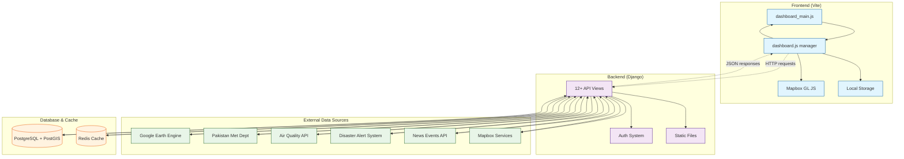
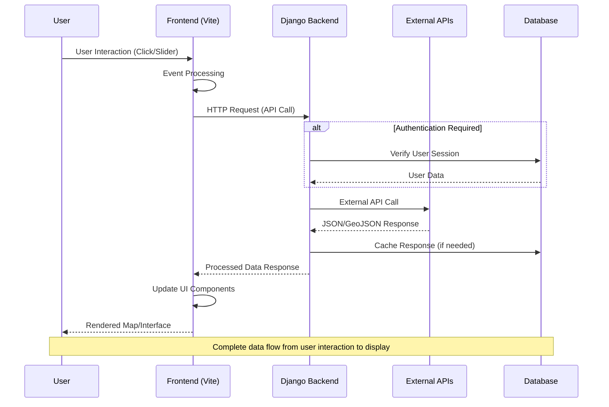

# NCOP - National Common Operating Picture

[](https://www.djangoproject.com/)
[](https://vitejs.dev/)
[](https://docs.mapbox.com/mapbox-gl-js/)
[](https://postgis.net/)

A sophisticated geospatial dashboard platform for climate monitoring, disaster management, and environmental data visualization. NCOP integrates multiple data sources to provide real-time monitoring and analysis capabilities for national climate and disaster management operations.

## 🌟 Key Features

- **Interactive Mapping**: Advanced Mapbox GL JS integration with 3D terrain and multiple projections
- **Multi-Source Data Integration**: Real-time weather, air quality, satellite imagery, and disaster data
- **Temporal Analysis**: Time-series exploration with animated data visualization
- **Story System**: Location-based narrative mapping for contextual information
- **Real-time Monitoring**: Live data feeds from multiple environmental sensors
- **User Management**: Secure authentication and personalized preferences
- **Responsive Design**: Modern UI with Tailwind CSS and glassmorphism effects

## 🏗️ System Architecture



## 📊 Data Flow Architecture



## 🚀 Technology Stack

### Frontend
- **Vite 5.3**: Build tool and development server
- **JavaScript ES6+**: Modern JavaScript with modules
- **Mapbox GL JS 3.15**: Interactive mapping and 3D visualization
- **Tailwind CSS 4.1**: Utility-first CSS framework
- **Bootstrap 5.3**: UI components and grid system
- **Chart.js 4.5**: Data visualization charts

### Backend
- **Django 5.1**: Web framework and API backend
- **PostgreSQL + PostGIS**: Spatial database
- **Django REST Framework**: API development
- **WhiteNoise**: Static file serving
- **Redis**: Caching and session storage
- **12+ API View Classes**: StoriesView, WeatherDataPMDFFDView, WAQIgeojson, DynamicGEELayerView, GEECatalogView, etc.

### External Integrations
- **Google Earth Engine**: Satellite imagery and geospatial analysis
- **Pakistan Meteorological Department**: Weather data
- **World Air Quality Index**: Air quality monitoring
- **GDACS**: Disaster alert system
- **GDELT**: News event data
- **Mapbox**: Mapping services and tiles

## 📁 Project Structure

```
ncop_local/
├── project/                    # Django backend
│   ├── ncop_project/          # Main Django project
│   │   ├── settings/          # Environment-specific settings
│   │   │   ├── base.py        # Base configuration
│   │   │   ├── dev.py         # Development settings
│   │   │   ├── prod.py        # Production settings
│   │   │   └── staging.py     # Staging settings
│   │   ├── urls.py            # Main URL routing
│   │   └── wsgi.py            # WSGI configuration
│   ├── ncop_internal/         # Main Django app
│   │   ├── views.py           # API endpoints and view logic
│   │   ├── models.py          # Data models
│   │   ├── urls.py            # App-specific URL routing
│   │   └── admin.py           # Django admin configuration
│   ├── templates/             # HTML templates
│   │   ├── dashboard.html     # Main dashboard template
│   │   └── auth/              # Authentication templates
│   └── static/dist/           # Built frontend assets
├── frontend/                  # Vite frontend application
│   ├── src/
│   │   ├── entries/           # Entry points for different pages
│   │   │   ├── dashboard_main.js
│   │   │   ├── auth_login.js
│   │   │   ├── auth_signup.js
│   │   │   └── auth_reset.js
│   │   ├── modules/           # JavaScript modules
│   │   │   ├── dashboard.js
│   │   │   ├── map-controls.js
│   │   │   ├── map-layers.js
│   │   │   ├── story-manager.js
│   │   │   └── time-slider.js
│   │   ├── styles/            # CSS files
│   │   └── assets/            # Images, icons, story JSONs
│   ├── templates/             # Frontend templates
│   ├── dist/                  # Built assets
│   └── vite.config.js         # Vite configuration
├── misc/                      # Documentation and utilities
├── requirements.txt           # Python dependencies
├── .env.example              # Environment variables template
└── AGENTS.md                 # Development guide for agents
```

## 🛠️ Installation & Setup

### Prerequisites

- **Python 3.11+**: Backend development
- **Node.js 18+**: Frontend development
- **PostgreSQL 15+**: Database with PostGIS extension
- **Redis**: Caching (optional but recommended)
- **Git**: Version control

### Quick Start

1. **Clone the Repository**
   ```bash
   git clone <repository-url>
   cd ncop_local
   ```

2. **Backend Setup**
   ```bash
   # Create virtual environment
   python -m venv venv
   source venv/bin/activate  # On Windows: venv\Scripts\activate
   
   # Install dependencies
   pip install -r requirements.txt
   
   # Configure environment variables
   cp .env.example .env
   # Edit .env with your configuration
   ```

3. **Database Setup**
   ```bash
   # Create PostgreSQL database with PostGIS
   createdb ncop
   psql ncop -c "CREATE EXTENSION postgis;"
   
   # Run migrations
   cd project
   python manage.py makemigrations
   python manage.py migrate
   
   # Create superuser
   python manage.py createsuperuser
   ```

4. **Frontend Setup**
   ```bash
   cd frontend
   npm install
   ```

5. **Start Development Servers**
   ```bash
   # Terminal 1: Frontend
   cd frontend
   npm run dev
   
   # Terminal 2: Backend
   cd project
   python manage.py runserver
   ```

6. **Access the Application**
   - Frontend: http://localhost:5173
   - Backend API: http://localhost:8000
   - Admin Panel: http://localhost:8000/admin

### Environment Variables

Create a `.env` file in the project root with the following variables:

```bash
# Django Configuration
DJANGO_SECRET_KEY=your-secret-key-here
DJANGO_DEBUG=True
DJANGO_ALLOWED_HOSTS=localhost,127.0.0.1

# Database Configuration
POSTGRES_DB=ncop
POSTGRES_USER=ncop
POSTGRES_PASSWORD=your-password
POSTGRES_HOST=localhost
POSTGRES_PORT=5432

# External API Keys
MAPBOX_ACCESS_TOKEN=your-mapbox-token
METEOBLUE_TOKEN=your-meteoblue-token
WAQI_API_TOKEN=your-waqi-token

# Google Earth Engine
GEE_PROJECT_ID=your-gee-project-id

# Frontend Configuration
VITE_DEV_MODE=True
VITE_DEV_SERVER_HOST=localhost
VITE_DEV_SERVER_PORT=5173
```

## 🎯 Core Features

### 1. Interactive Mapping

- **Multiple Projections**: Switch between Mercator, Globe, and custom projections
- **3D Terrain**: DEM-based terrain visualization
- **Layer Management**: Dynamic layer addition/removal with opacity controls
- **Custom Controls**: Tailored map interaction tools

### 2. Multi-Source Data Integration

- **Weather Data**: Real-time conditions from Pakistan Meteorological Department
- **Air Quality**: WAQI station data with health indicators
- **Disaster Tracking**: GDACS alerts and event details
- **Satellite Imagery**: Google Earth Engine integration for historical analysis

### 3. Temporal Analysis

- **Time Slider**: Interactive temporal data exploration
- **Historical Data**: Time-series analysis capabilities
- **Animation**: Play/pause functionality for temporal data
- **Dynamic Legends**: Context-aware legend generation

### 4. Story System

- **Narrative Maps**: Location-based storytelling
- **Chapter Navigation**: Sequential story progression
- **Dynamic Layers**: Context-specific layer activation
- **Rich Media**: Support for images, videos, and custom content

### 5. User Management

- **Secure Authentication**: Login/signup with password reset
- **Session Management**: Secure user sessions
- **Preferences Storage**: Local storage for user settings
- **Personalized Experience**: Customizable dashboard and map preferences

## 📚 API Documentation

### Authentication Endpoints

| Endpoint | Method | Description |
|----------|--------|-------------|
| `/login/` | POST | User authentication |
| `/signup/` | POST | User registration |
| `/logout/` | POST | User logout |
| `/password-reset/` | POST | Password reset request |

### Data Endpoints

| Endpoint | Method | Description |
|----------|--------|-------------|
| `/get-weather-pmdffd-data/` | GET | Weather data from PMD |
| `/get-waqi-global-airquality/` | GET | Global air quality data |
| `/api/gee/dynamic-layer/` | GET | Dynamic GEE satellite layers |
| `/get-gdacs-events/` | GET | Disaster event data |
| `/stories/` | GET | Story management |

### Example API Response

```json
{
  "type": "FeatureCollection",
  "features": [
    {
      "type": "Feature",
      "geometry": {
        "type": "Point",
        "coordinates": [71.0, 30.5]
      },
      "properties": {
        "name": "Location Name",
        "value": 100,
        "timestamp": "2025-01-05T12:00:00Z"
      }
    }
  ]
}
```

## 🎨 Frontend Architecture

### Module Organization

```mermaid
graph TD
    MAIN[dashboard_main.js] --> DASH[dashboard.js]
    
    DASH --> MAP[map-controls.js]
    DASH --> NAV[navigation-panel.js]
    DASH --> PROJ[projection-panel.js]
    DASH --> BASE[basemap-panel.js]
    DASH --> SIDEBAR[sidebar-menu.js]
    DASH --> UTIL[utility-manager.js]
    DASH --> USER[user-control.js]
    DASH --> SOURCE[sourcelayer-control.js]
    DASH --> ORDER[layer-order-control.js]
    DASH --> INFO[layer-info-panel.js]
    DASH --> POPUP[layer-attribute-popup.js]
    
    DASH --> TIME[time-functions.js]
    DASH --> LAYERS[map-layers.js]
    DASH --> TIME_SLIDER[time-slider-functionality.js]
    DASH --> TEMP_LEGEND[temporal-layer-legends.js]
    DASH --> MAPBOX[mapbox-functions.js]
    
    DASH --> STORAGE[local-storage-manager.js]
    
    classDef entry fill:#e3f2fd,stroke:#1976d2
    classDef core fill:#f3e5f5,stroke:#7b1fa2
    classDef feature fill:#e8f5e8,stroke:#388e3c
    classDef util fill:#fff3e0,stroke:#f57c00
    
    class MAIN entry
    class DASH core
    class MAP,NAV,PROJ,BASE,SIDEBAR,USER,SOURCE,ORDER,INFO,POPUP feature
    class TIME,LAYERS,TIME_SLIDER,TEMP_LEGEND,MAPBOX feature
    class STORAGE,UTIL util
```



### Key JavaScript Modules

- **`dashboard_main.js`**: Main entry point and initialization
- **`map-controls.js`**: Core map interactions and state management
- **`story-manager.js`**: Narrative mapping and story system
- **`time-slider.js`**: Temporal data controls and animation
- **`layer-management.js`**: Dynamic layer loading and control
- **`local-storage-manager.js`**: Client-side data persistence

## 🧪 Testing

### Backend Tests

```bash
# Run all tests
cd project && python manage.py test

# Run specific app tests
cd project && python manage.py test ncop_internal

# Run with verbose output
cd project && python manage.py test --verbosity=2
```

### Frontend Tests

```bash
cd frontend
npm test  # If test framework is configured
```

### Manual Testing Checklist

- [ ] User authentication flow
- [ ] Map loading and interaction
- [ ] Layer addition/removal
- [ ] Time slider functionality
- [ ] Story system navigation
- [ ] API endpoint responses
- [ ] Responsive design on mobile devices

## 🚀 Deployment

### Development Environment

```bash
# Frontend
cd frontend && npm run dev

# Backend
cd project && python manage.py runserver
```

### Production Build

```bash
# Build frontend assets
cd frontend && npm run build

# Copy manifest to Django
npm run build-and-copy

# Collect static files
cd project && python manage.py collectstatic --noinput
```

### Production Server

```bash
# Using Waitress (WSGI server)
pip install waitress
waitress-serve --host=0.0.0.0 --port=8000 ncop_project.wsgi:application
```

### Nginx Configuration

```nginx
server {
    listen 80;
    server_name your-domain.com;

    location /static/ {
        alias /path/to/project/static/dist/;
        expires 1y;
        add_header Cache-Control "public, immutable";
    }

    location / {
        proxy_pass http://127.0.0.1:8000;
        proxy_set_header Host $host;
        proxy_set_header X-Real-IP $remote_addr;
    }
}
```

## 🔧 Configuration

### Django Settings

The project uses environment-specific settings:

- **`base.py`**: Core configuration and third-party integrations
- **`dev.py`**: Development-specific settings
- **`staging.py`**: Staging environment configuration
- **`prod.py`**: Production optimization and security

### Vite Configuration

Frontend build configuration in `frontend/vite.config.js`:

- **Development Server**: HMR with polling for Windows compatibility
- **Build Process**: Multi-entry point build with manifest generation
- **Asset Optimization**: Tree shaking and code splitting

## 🤝 Contributing

We welcome contributions to the NCOP platform! Please follow these guidelines:

### Development Workflow

1. **Fork the repository**
2. **Create a feature branch**: `git checkout -b feature/amazing-feature`
3. **Make your changes** following the code style guidelines
4. **Add tests** for new functionality
5. **Run the test suite**: `python manage.py test && npm test`
6. **Commit your changes**: `git commit -m 'Add amazing feature'`
7. **Push to branch**: `git push origin feature/amazing-feature`
8. **Open a Pull Request**

### Code Style Guidelines

- **Python**: Follow PEP 8, use Black for formatting
- **JavaScript**: Use ES6+ features, follow the existing module patterns
- **CSS**: Use Tailwind utility classes, organize custom CSS logically
- **Documentation**: Update README and add inline comments for complex logic

### Issue Reporting

When reporting issues, please include:

- **Environment**: OS, Python version, Node version
- **Browser**: If it's a frontend issue
- **Steps to reproduce**: Detailed reproduction steps
- **Expected behavior**: What you expected to happen
- **Actual behavior**: What actually happened
- **Error messages**: Any relevant error logs

## 📖 User Guide

### Getting Started

1. **Login**: Use your credentials to access the dashboard
2. **Explore Layers**: Browse available data layers in the sidebar
3. **Navigate Map**: Use mouse/touch to pan, zoom, and rotate
4. **Temporal Analysis**: Use the time slider to explore historical data
5. **Stories**: Click on story entries to explore narrative maps

### Map Controls

- **Pan**: Click and drag
- **Zoom**: Scroll wheel or pinch gestures
- **Rotate**: Right-click and drag (3D mode)
- **Tilt**: Shift + drag (3D terrain mode)

### Layer Management

- **Add Layers**: Browse the layer catalog and click to add
- **Adjust Opacity**: Use the opacity slider for each layer
- **Toggle Visibility**: Click the layer checkbox
- **Reorder**: Drag layers to change rendering order

### Story Navigation

- **Browse Stories**: Select from the story library
- **Chapter Navigation**: Use next/previous buttons
- **Auto-play**: Start automatic story progression
- **Interactive Elements**: Click on map features for details

## 🐛 Troubleshooting

### Common Issues

#### Frontend Issues

**Problem**: Map not loading
- **Solution**: Check Mapbox token in environment variables
- **Verify**: Network connectivity and CORS settings

**Problem**: HMR not working
- **Solution**: Check Vite dev server configuration
- **Verify**: Port conflicts and firewall settings

#### Backend Issues

**Problem**: Database connection failed
- **Solution**: Verify PostgreSQL is running and credentials are correct
- **Check**: PostGIS extension is installed

**Problem**: External API timeouts
- **Solution**: Check network connectivity and API rate limits
- **Verify**: API keys are valid and not expired

### Performance Optimization

- **Frontend**: Enable lazy loading for heavy layers
- **Backend**: Implement Redis caching for API responses
- **Database**: Add spatial indexes for geospatial queries
- **Network**: Use CDN for static assets

### Security Considerations

- **Environment Variables**: Never commit secrets to version control
- **CSRF Protection**: Ensure Django CSRF middleware is enabled
- **API Authentication**: Implement proper token-based authentication
- **Data Validation**: Sanitize all user inputs and API responses


## 📞 Support

For support and questions:

- **Documentation**: Check this README and the `/docs` folder
- **Issues**: Open an issue on GitHub
- **Discussions**: Join our GitHub Discussions
- **Email**: Contact the development team

## 🗺️ Roadmap

### Upcoming Features

- **Real-time Collaboration**: Multi-user map interactions
- **Advanced Analytics**: Machine learning-based predictions
- **Mobile App**: Native mobile applications
- **API Expansion**: Additional data source integrations
- **Performance Improvements**: Enhanced caching and optimization

### Version History

- **v2.0**: Current version with full feature set
- **v1.5**: Added story system and temporal analysis
- **v1.0**: Initial release with basic mapping

---
